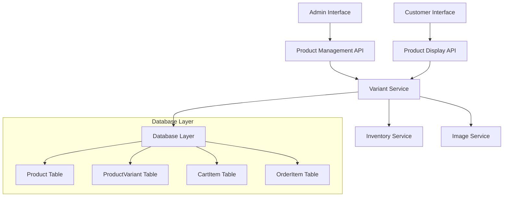

# Design Document: Product Variant Management

## Overview

The Product Variant Management system extends Attireburg's e-commerce platform to support products with multiple variants (sizes, colors, styles) while maintaining individual inventory tracking, pricing, and availability for each variant. This system enhances both the administrative experience for product management and the customer shopping experience by providing detailed product options with accurate inventory information.

The system integrates seamlessly with the existing Next.js/React architecture, PostgreSQL database via Prisma ORM, and maintains compatibility with the current cart and order management systems.

## Architecture

### High-Level Architecture



### Component Interaction Flow

1. **Admin Workflow**: Admin creates/edits products → Defines attributes → Generates variants → Manages inventory
2. **Customer Workflow**: Customer views product → Selects variant attributes → Adds to cart → Proceeds to checkout
3. **Inventory Management**: Real-time stock tracking → Availability updates → Order fulfillment

## Components and Interfaces

### Core Components

#### 1. Variant Management Service
- **Purpose**: Central service for variant CRUD operations
- **Responsibilities**:
  - Variant creation and generation
  - Attribute management
  - Inventory tracking
  - Price management

#### 2. Product Display Service
- **Purpose**: Customer-facing variant selection and display
- **Responsibilities**:
  - Variant option presentation
  - Real-time availability checking
  - Price calculation
  - Image management

#### 3. Cart Integration Service
- **Purpose**: Variant-aware cart operations
- **Responsibilities**:
  - Variant-specific cart items
  - Stock validation
  - Price calculation with variants

#### 4. Admin Interface Components
- **Purpose**: Administrative variant management UI
- **Responsibilities**:
  - Variant generation interface
  - Bulk editing tools
  - Inventory management
  - Image upload per variant

### API Interfaces

#### Variant Management API
```typescript
interface VariantAPI {
  // Generate variants from attributes
  generateVariants(productId: string, attributes: ProductAttribute[]): Promise<ProductVariant[]>
  
  // CRUD operations
  createVariant(productId: string, variant: CreateVariantRequest): Promise<ProductVariant>
  updateVariant(variantId: string, updates: UpdateVariantRequest): Promise<ProductVariant>
  deleteVariant(variantId: string): Promise<void>
  
  // Bulk operations
  bulkUpdateInventory(updates: BulkInventoryUpdate[]): Promise<void>
  bulkUpdatePricing(updates: BulkPricingUpdate[]): Promise<void>
}
```

#### Product Display API
```typescript
interface ProductDisplayAPI {
  // Get product with variants
  getProductWithVariants(productId: string): Promise<ProductWithVariants>
  
  // Find variant by attributes
  findVariantByAttributes(productId: string, attributes: Record<string, string>): Promise<ProductVariant | null>
  
  // Get available attribute values
  getAvailableAttributes(productId: string): Promise<Record<string, string[]>>
}
```

## Data Models

### Enhanced Product Model
```typescript
interface Product {
  id: string
  name: string
  nameEn: string
  description: string
  descriptionEn: string
  price: number
  salePrice?: number
  images: string[]
  category: string
  stock: number
  hasVariants: boolean
  attributes?: ProductAttribute[]
  variants?: ProductVariant[]
  // ... existing fields
}
```

### Product Variant Model
```typescript
interface ProductVariant {
  id: string
  productId: string
  sku: string
  price?: number        // Override parent price if different
  salePrice?: number    // Override parent sale price if different
  stock: number         // Individual inventory tracking
  images: string[]      // Variant-specific images
  attributes: Record<string, string>  // e.g., {"color": "red", "size": "L"}
  isActive: boolean
  createdAt: Date
  updatedAt: Date
}
```

### Product Attribute Model
```typescript
interface ProductAttribute {
  name: string          // e.g., "Color", "Size"
  values: string[]      // e.g., ["Red", "Blue", "Green"]
  visible: boolean      // Show on product page
  variation: boolean    // Use for variant generation
}
```

### Enhanced Cart Item Model
```typescript
interface CartItem {
  id: string
  productId: string
  variantId?: string    // Reference to specific variant
  quantity: number
  size: string          // Legacy support
  color?: string        // Legacy support
  attributes?: Record<string, string>  // Variant attributes
  // ... existing fields
}
```

## Correctness Properties

*A property is a characteristic or behavior that should hold true across all valid executions of a system-essentially, a formal statement about what the system should do. Properties serve as the bridge between human-readable specifications and machine-verifiable correctness guarantees.*

### Property Reflection

After analyzing all acceptance criteria, several properties can be consolidated:
- Properties 1.1, 1.3, and 6.1 all relate to variant data persistence and can be combined into a comprehensive variant storage property
- Properties 3.2 and 4.1 both deal with availability calculation and can be merged
- Properties 6.3 and 6.4 are complementary inventory operations that can be tested together as inventory consistency

### Core Properties

**Property 1: Variant data persistence**
*For any* product with variants, when variant attributes, inventory, or pricing are set, then retrieving the variant should return exactly the same data
**Validates: Requirements 1.1, 1.3, 1.4, 1.5, 6.1**

**Property 2: Variant generation completeness**
*For any* set of product attributes marked for variation, generating variants should produce exactly all possible combinations of attribute values
**Validates: Requirements 2.1**

**Property 3: SKU uniqueness across variants**
*For any* product with generated variants, no two variants should have the same SKU
**Validates: Requirements 2.2**

**Property 4: Variant preservation during regeneration**
*For any* product with existing variants, regenerating variants with the same attribute combinations should preserve existing variant data (inventory, pricing, images)
**Validates: Requirements 2.4**

**Property 5: Available variant filtering**
*For any* product with variants, only variants that are active and have stock > 0 should be included in available options
**Validates: Requirements 3.1, 4.2**

**Property 6: Variant selection consistency**
*For any* valid combination of variant attributes, selecting those attributes should return the correct variant with accurate price and availability information
**Validates: Requirements 3.2, 4.1**

**Property 7: Out-of-stock variant blocking**
*For any* variant with stock = 0, attempting to add it to cart should be prevented and availability should show as unavailable
**Validates: Requirements 3.3, 4.2**

**Property 8: Cart variant information integrity**
*For any* variant added to cart, the cart item should contain the correct variant ID, attributes, and pricing information
**Validates: Requirements 3.4, 3.5**

**Property 9: Image fallback consistency**
*For any* variant, if variant-specific images exist they should be displayed, otherwise product images should be used as fallback
**Validates: Requirements 5.2, 5.3**

**Property 10: Inventory isolation between variants**
*For any* two different variants of the same product, inventory changes to one variant should not affect the inventory of the other variant
**Validates: Requirements 1.4, 6.3**

**Property 11: Order inventory consistency**
*For any* order containing variant items, placing the order should reduce inventory for exactly the purchased variants by the purchased quantities, and cancelling should restore the same amounts
**Validates: Requirements 6.3, 6.4**

**Property 12: Bulk operation consistency**
*For any* bulk inventory or pricing update, changes should be applied to exactly the specified variants and no others
**Validates: Requirements 2.3, 7.2, 7.3**

**Property 13: Variant aggregation accuracy**
*For any* product with variants, the total inventory count should equal the sum of all variant inventories, and variant count should equal the number of active variants
**Validates: Requirements 7.1**

## Error Handling

### Validation Errors
- **Invalid Attribute Combinations**: When customer selects attribute combinations that don't match any variant
- **SKU Conflicts**: When generating variants would create duplicate SKUs
- **Stock Validation**: When attempting to add more items to cart than available in variant stock
- **Missing Variant Selection**: When customer attempts to add variant product to cart without selecting a variant

### Data Consistency Errors
- **Orphaned Variants**: When product is deleted but variants remain
- **Invalid Inventory**: When variant inventory becomes negative
- **Missing Images**: When variant references images that no longer exist
- **Attribute Mismatch**: When variant attributes don't match product attribute definitions

### Recovery Strategies
- **Graceful Degradation**: Fall back to product-level inventory when variant inventory is unavailable
- **Automatic Cleanup**: Remove orphaned variants during product operations
- **Inventory Correction**: Prevent negative inventory through validation
- **Image Fallback**: Use product images when variant images are missing

## Testing Strategy

### Dual Testing Approach

The system requires both unit testing and property-based testing to ensure comprehensive coverage:

**Unit Testing**:
- Specific examples of variant generation with known attribute sets
- Edge cases like empty attributes, single attribute, or maximum attribute combinations
- Integration points between variant service and database
- Error conditions and validation scenarios

**Property-Based Testing**:
- Universal properties that should hold across all valid inputs
- Random generation of product attributes and variant combinations
- Stress testing with large numbers of variants and attributes
- Inventory consistency across random order sequences

**Property-Based Testing Framework**: 
We will use **fast-check** for JavaScript/TypeScript property-based testing, configured to run a minimum of 100 iterations per property test.

**Property Test Tagging**:
Each property-based test must be tagged with a comment explicitly referencing the correctness property from this design document using the format: `**Feature: product-variant-management, Property {number}: {property_text}**`

**Testing Requirements**:
- Each correctness property must be implemented by a single property-based test
- Unit tests focus on specific examples and integration points
- Property tests verify universal correctness across all inputs
- Both types of tests are complementary and required for comprehensive coverage

### Test Data Generation

**Smart Generators**:
- **Attribute Generator**: Creates realistic product attributes (Color, Size, Material) with appropriate value sets
- **Variant Generator**: Generates valid variant combinations from attribute sets
- **Inventory Generator**: Creates realistic inventory levels with edge cases (0, low stock, high stock)
- **Cart Generator**: Creates valid cart scenarios with variant selections

### Integration Testing

**End-to-End Scenarios**:
- Complete admin workflow: Create product → Add attributes → Generate variants → Manage inventory
- Complete customer workflow: Browse product → Select variant → Add to cart → Checkout
- Inventory management: Stock updates → Availability changes → Order fulfillment

**Database Integration**:
- Variant CRUD operations with proper foreign key relationships
- Transaction handling for bulk operations
- Data consistency across related tables (Product, ProductVariant, CartItem, OrderItem)

### Performance Testing

**Load Testing**:
- Product pages with large numbers of variants (100+ variants)
- Bulk inventory updates across multiple variants
- Concurrent variant selection by multiple customers

**Query Optimization**:
- Efficient variant filtering and availability checking
- Optimized joins between Product and ProductVariant tables
- Indexed queries for variant attribute searches